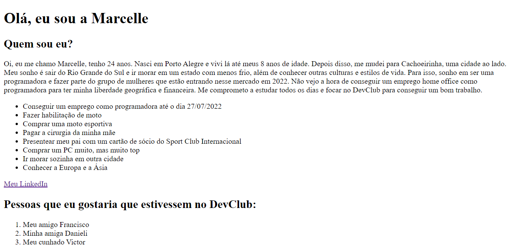

# Landing-Personal-Page

> Um dos meus primeiros contatos com HTML, essa Landing Page foi desenvolvida por mim com o auxílio das aulas do DevClub.

### Ajustes e melhorias

As próximas atualizações serão voltadas às seguintes tarefas:

- [ ] Estilizar com CSS
- [ ] Aplicar JavaScript

## 🤝 Colaboradores

Esse projeto foi desenvolvido individualmente.

<table>
  <tr>
    <td align="center">
      <a href="#">
         
        
          <b>Marcelle Marichal</b>
        
      </a>
    </td>
</table>

[⬆ Voltar ao topo](#Landing-Personal-Page) 
